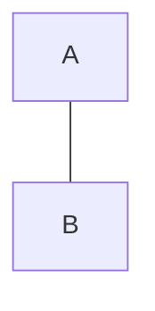

# AIOS-docs

OS nutshell:  

1. BIOS/UEFI Initialization:  
   , BIOS (Basic Input/Output System)  
   , UEFI (Unified Extensible Firmware Interface)
   , performs POST  
  
   POST:  
   , initializes hardware components   
   , seeks for a bootable device   
   , starts the Boot Loader    
  
3. Boot Loader:  
   GRUB, LILO, systemd-boot, ..  
  ,loads OS kernel into memory     
     , may provide a BOOT menu   
  , Kernel Initialization starts   

4. Kernel Initialization:  
  , Linux kernel is loads into memory  
  , Kernel starts executing   
    , initializes hardware  
    , mounts the root filesystem.  
       from bootloader configuration. 
  , kernel starts init process PID 1. 
  , Starts .init Processes.  
   
  
4 .init Process:  
   from systemd, Upstart, or OpenRC   
   , bringing up the user space    
   , starting system services   
   
  .init  
  , reads its configuration files
    SysV: /etc/inittab    
    systemd: ...     
  , starts necessary services  
  , starts necessary daemons   
  , System is Initialized.  
  
  System Initialization Scripts:   
  Depending on the init system    
  , SysV   
    /etc/rc.d/ and /etc/init.d/   
  , systemd  
    /etc/systemd/system/   
    /lib/systemd/system/   
  , starts system services & daemons  
  , gives Login Prompt  
   
  
5. Login Process   
   GUI: GDM, LightDM, ...   
   Servers : sh - text-based getty   
   , User logs in   
   , runs  .profile.  
